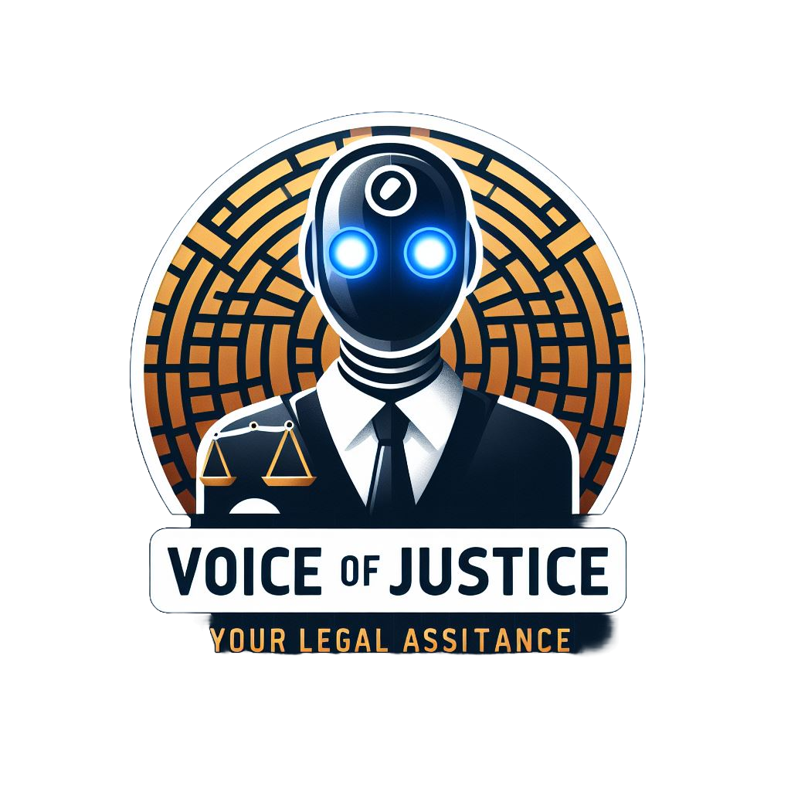

<h1 >Voice of Justice ⚖️</h1>

<p align="left">
  
</p>

## Project Overview 🌟
Voice of Justice (VOJ) is an AI-assisted legal consultation platform designed to connect individuals who need legal services but cannot afford them with lawyers who offer pro bono work. We are committed to fostering a respectful, inclusive, and collaborative community where contributors work together to enhance this platform for all users.

## Code of Conduct 📜
We are committed to fostering a safe and inclusive environment for all users. Please review our [Code of Conduct](Code_Of_Conduct.md) to understand the expected behavior and guidelines while using the Voice of Justice platform.

## Features 📋
Some of the key features of our project includes : 
- **AI-Powered Legal Consultation**: Our platform utilizes AI to provide users with personalized legal advice
- **Pro Bono Lawyer Network**: Connects users with lawyers who offer free legal services
- **Community Forum**: A space for users to share their experiences, ask questions, and get support
- **Resource Library**: A collection of legal resources, including articles, videos, and podcasts
- **User Profile**: Users can create profiles to track their progress and access their case history
- **Case Management**: Users can manage their cases, including uploading documents and communicating with lawyers
- **Payment Gateway**: Secure payment processing for users who need additional services
- **Chatbot Assistance**: A chatbot that answers common legal questions and provides guidance on the next steps.
-  **User Feedback**: Users can provide feedback on their experience with the platform and suggest improvements.

## Technology Stack 💻
Our platform is built using the following technologies:
- JavaScript
- HTML
- CSS
- SCSS

## 💖 Sponsorship

We welcome contributions to the **Voice of Justice** platform, not just through code but also through your generous donations. Your support helps us maintain and improve the platform, ensuring our chatbot continues to run smoothly and provide free, high-quality legal assistance to those who need it.

By sponsoring this project, you'll be helping us keep this service free for clients and make legal guidance more accessible to everyone. Every contribution, big or small, makes a difference! 🙏

If you’d like to contribute financially, please consider becoming a sponsor. Your support means the world to us! 🌟

[Become a Sponsor](#)

## Contribution Guidelines 💡

We welcome contributions to the Voice of Justice (VOJ) project! If you would like to help improve the platform, please follow these guidelines:

### How to Contribute

1. **Fork the Repository**: Click the "Fork" button in the top right corner of the repository page to create your own copy of the project.

2. **Clone Your Fork**: Clone your forked repository to your local machine using the following command:
   ```bash
   git clone https://github.com/yourusername/VOJ.git
3. **Make Your Changes**: Implement your feature or fix the bug. Ensure that your code follows the project's coding standards and style guidelines.
4. **Commit Your Changes**: Commit your changes with a clear and descriptive commit message.
    ```bash
    git commit -m "Add a brief description of your changes"
5. **Push Your Changes**: Push your changes to your forked repository.
6. **Create a Pull Request**: Go to the original repository and click the "New Pull Request" button. Provide a clear description of your changes and why they should be merged.

## Contributors 🤝
You can view the full list of contributors on our [GitHub Contributors page](https://github.com/Data-Sculptor-X/VOJ-ReactJS/graphs/contributors).

## Thank You to Our Contributors! 🙏

We want to extend a heartfelt thank you to all the contributors who have helped make the Voice of Justice (VOJ) project. Your dedication, creativity, and hard work are invaluable to us.

Whether you have submitted code, reported issues, provided feedback, or helped spread the word, every contribution matters and makes a difference. Together, we are building a platform that can truly impact lives.

We look forward to your continued involvement and support as we grow and improve this project together!
